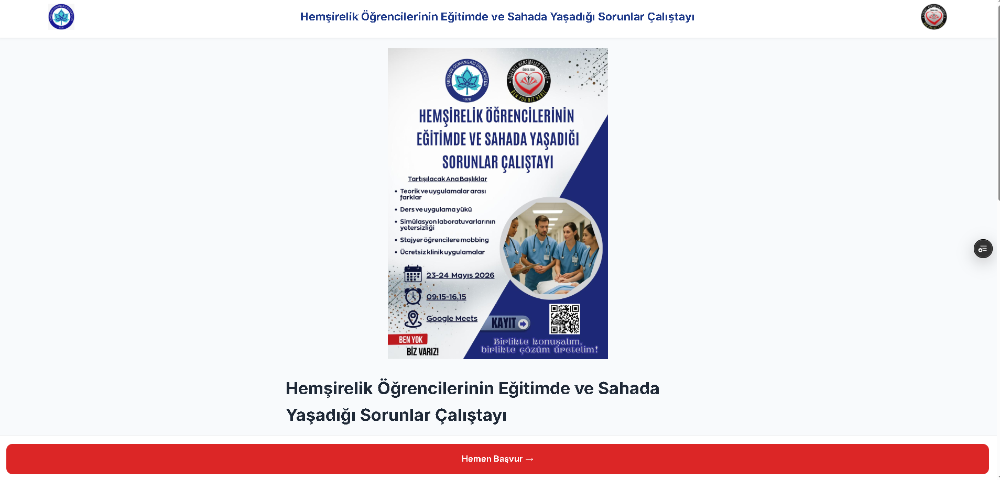
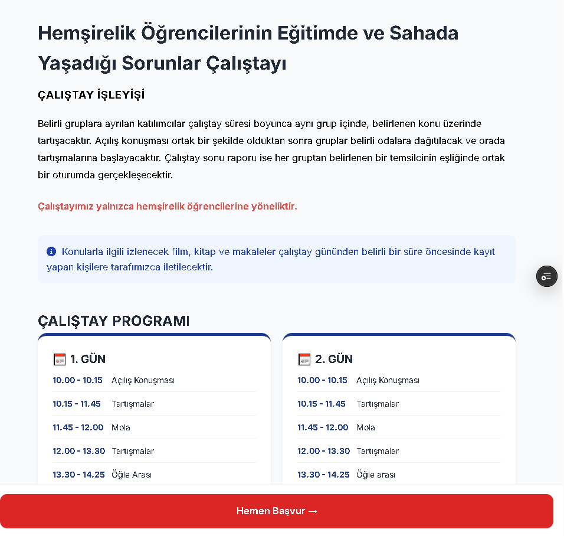
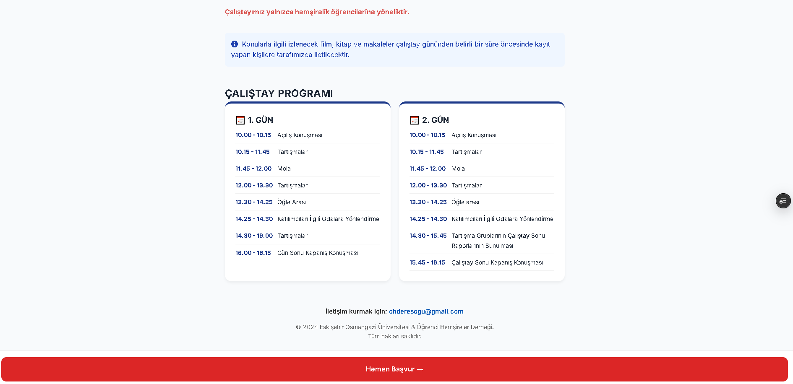
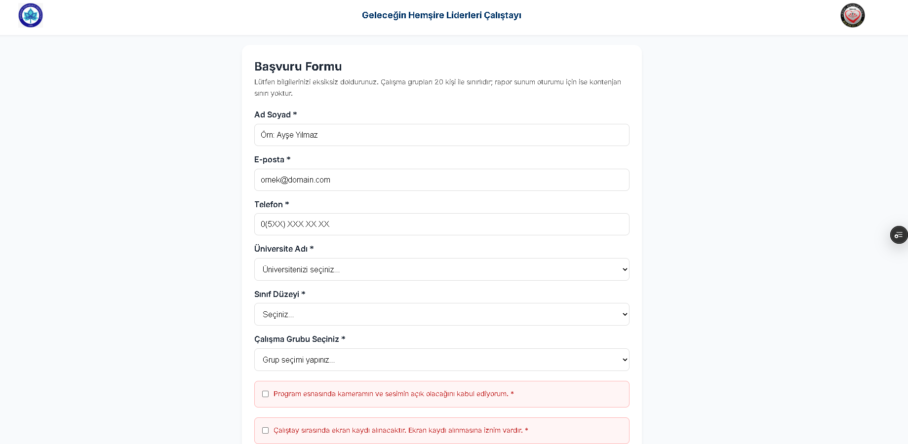
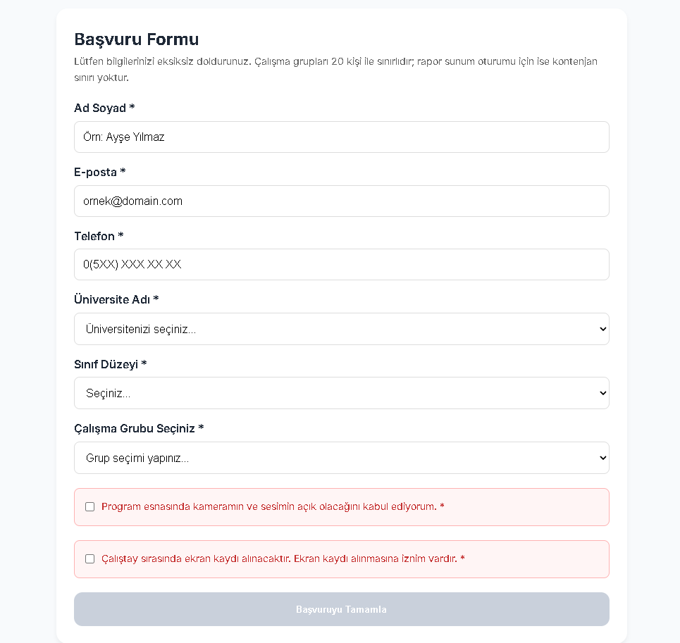
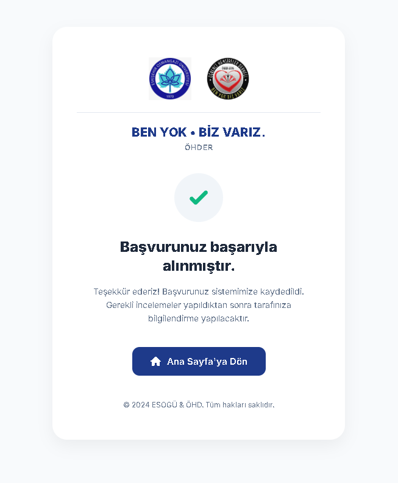

#  Hemşirelik Öğrencileri Çalıştayı Başvuru Sistemi

Modern web teknolojileri kullanılarak geliştirilmiş bu proje, üniversite öğrencilerine yönelik düzenlenen **"Geleceğin Hemşire Liderleri Çalıştayı"** için online başvuru ve yönetim sistemi sunar.

Kullanıcılar başvurularını kolayca yapabilirken, yöneticiler tüm başvuruları şifre korumalı merkezi bir panel üzerinden anlık olarak görüntüleyebilir.

---

##  Canlı Demo

* **Başvuru Formu:**
  https://calistay-basvuruformu.vercel.app

*  **Yönetici Paneli:**
  https://calistay-admin-panel.vercel.app

---

##  Özellikler

*  Online başvuru formu
*  Gerçek zamanlı kontenjan takibi
*  Akıllı e-posta doğrulama sistemi
*  Yönetici paneli (login korumalı)
*  Mobil uyumlu tasarım
*  Vercel ile hızlı yayın

---

##  Kullanılan Teknolojiler

| Teknoloji  | Açıklama                   |
| ---------- | -------------------------- |
| HTML5      | Sayfa yapısı               |
| CSS3       | Tasarım ve responsive yapı |
| JavaScript | Dinamik işlemler           |
| Supabase   | Veritabanı                 |
| Vercel     | Hosting                    |

---

##  Ekran Görüntüleri

###  Ana Sayfa







---

###  Başvuru Formu





---

###  Başarılı Başvuru



---

##  Güvenlik Politikası

* Supabase **Row Level Security (RLS)** aktif
* Kullanıcılar yalnızca veri ekleyebilir (insert)
* Veri okuma ve silme yetkisi kısıtlıdır
* Yönetici paneli giriş sistemi ile korunur

---

##  Proje Yapısı

```
 calistay_basvuruformu
 ┣ 📂 img
 ┣ 📂 screenshots
 ┃ ┣ anasayfa1.png
 ┃ ┣ anasayfa2.png
 ┃ ┣ anasayfa3.png
 ┃ ┣ basvuru1.png
 ┃ ┣ basvuru2.png
 ┃ ┗ basarili.png
 ┣ 📄 index.html
 ┣ 📄 basvuru.html
 ┣ 📄 basarili.html
 ┣ 📄 style.css
 ┗ 📄 README.md
```

---

##  Proje Hakkında

Bu proje, üniversite öğrencilerinin katılım sağlayacağı bir çalıştay organizasyonunun başvuru sürecini dijitalleştirmek amacıyla geliştirilmiştir.

Amaçlar:

* Başvuru sürecini kolaylaştırmak
* Verileri güvenli şekilde toplamak
* Yönetim sürecini hızlandırmak

---

##  Kullanım

1. Başvuru formunu aç
2. Bilgileri doldur
3. Veriler Supabase’e kaydedilir
4. Admin panelden görüntülenir

---

##  Geliştirici

**Ceren Nur Çetin**

---

## Not

Bu proje gerçek bir organizasyon için geliştirilmiş olup aktif olarak kullanılmaktadır.
